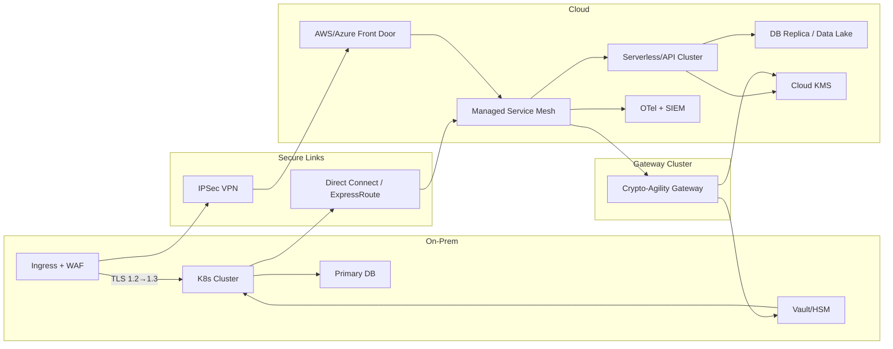
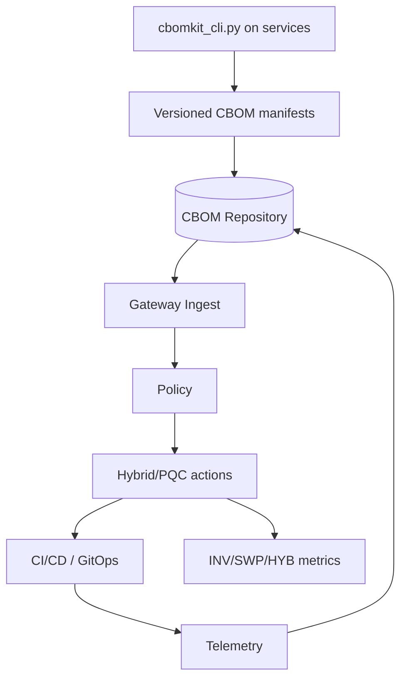
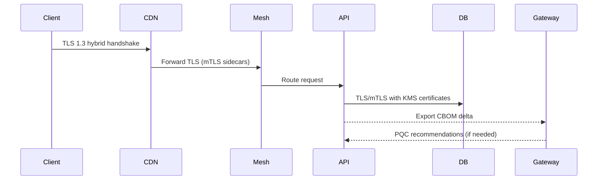
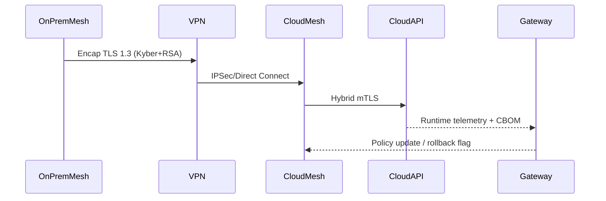
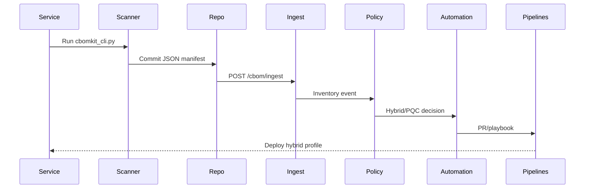
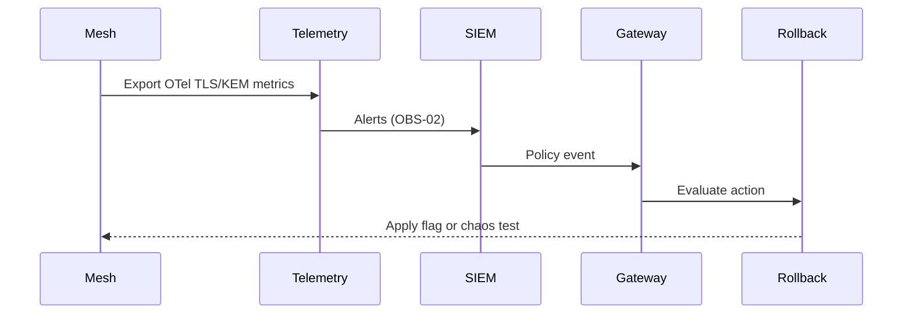

# Conceptual Modeling of the Hybrid Three-Tier Environment — Sprint 3 (Weeks 5–6)

## 1. Introduction
Sprint 3 of Module 14 (Weeks 5 and 6) consolidates the conceptual modeling of the hybrid three-tier environment and the communication flows that will integrate with the crypto-agility gateway described in Sprint 2 (`docs/module14/gateway-architecture.md`). After the literature review and vulnerability mapping from Module 13 (`docs/module13/en/Crypto-Agility.md`; `docs/module13/en/vulnerability.md`), Sprint 2 established the CBOM gateway prototype (`code/cbom_gateway.py`) and the metrics matrix (`docs/module14/metrics-resilience-matrix.md`). Sprint 3 leverages these foundations to formally represent the hybrid environment (on-premise + cloud) mandated by the academic plan TAPI (`docs/module14/TAPI-Modulo14.txt`).

Modeling is critical for crypto-agility because:
- It exposes dependencies between web, application, and data layers that affect inventory, automation, and rollback (see `docs/governance/rm-odp-simulated-environment-pt.md`).
- It delimitates where legacy classical algorithms (RSA-2048, ECDH-P256) must transition to hybrid/PQC profiles (Kyber, Dilithium, SPHINCS+) according to NIST PQC recommendations (FIPS 203–205) and the literature (`docs/module13/en/literature-review.md`).
- It guarantees traceability between R–A–C/V requirements (`docs/governance/mapa-artigos-requisitos.md`) and architectural decisions, preparing the environment for the Sprint 4 metrics.

## 2. Overview of the Hybrid Three-Tier Environment

| Layer | Function | On-prem resources | Cloud resources | Vulnerabilities and crypto dependencies (Sprint 1) |
| --- | --- | --- | --- | --- |
| Web / Presentation | CDN/WAF, TLS 1.3 termination, SPA | Reverse proxies with local HSM for classical termination | Cloud front-door (e.g., AWS CloudFront, Azure Front Door) with hybrid TLS | Legacy TLS (allowing TLS 1.0/1.1) and expired certificates (`docs/governance/vulnerabilidades-3tier.md`). Requires continuous CBOM inventory (`docs/module13/en/Crypto-Agility.md`). |
| Application / Business | Service mesh, APIs, workers | Microservices in on-prem Kubernetes with mTLS sidecars | Microservices in managed clusters (EKS/AKS/IBM Code Engine) with liboqs support | Hardcoded secrets and outdated crypto libraries (`docs/governance/vulnerabilidades-3tier.md`). Dependent on automation SWP-01/02 (`docs/module14/metrics-resilience-matrix.md`). |
| Data / Persistence | Relational databases, backup tapes | PostgreSQL clusters, HSM for backup signatures | Cloud storage (S3/IBM COS), managed relational database | Missing at-rest crypto, legacy backups (`docs/governance/vulnerabilidades-3tier.md`). Requires KMS with PQC-ready keys and SPHINCS+ for integrity. |

**On-prem resources:** dedicated data center with Kubernetes, IPSec VPN/Direct Connect to cloud, local HSM, bastion host, and private CI/CD pipeline. **Cloud resources:** multi-account landing zone (AWS/Azure/IBM) with service mesh, managed KMS, object storage, SIEM/SOAR, and load-testing tools.

**Critical points:**
- TLS/mTLS interoperability between on-premise and cloud; transition to hybrid profiles Kyber-768 + RSA-3072 per NIST SP 1800-38 and `docs/module14/gateway-architecture.md`.
- Dependence on daily CBOM (INV-01) to identify components using RSA-2048/ECDH-P256.
- Telemetry required to detect “harvest-now, decrypt-later” campaigns (`docs/governance/pontos-executivos-hndl.md`).

## 3. Conceptual Architecture of the Hybrid Environment

### 3.1 Components and Integrations
- **Web Front:** CDN/WAF, edge TLS 1.3 hybrid with classical fallback. Integrates with the gateway through CBOM exports (TLS configs) and TLS telemetry.
- **Application Layer:** Service mesh (Istio/Linkerd) with hybrid mTLS sidecars, APIs, workers. Collects CBOM via `code/cbomkit_cli.py` and publishes manifests (`code/samples/cbom-three-tier.json`).
- **Data Layer:** Relational database (on-prem replicated to cloud), backup storage, logs, Secrets/KMS (Vault + AWS KMS). Uses RSA-3072/Dilithium for backup signatures.
- **Crypto-Agility Gateway:** Ingest, Policy, Automation, Telemetry, Rollback, Observability modules (`docs/module14/gateway-architecture.md`).
- **External Cloud Services:** AWS KMS, IBM Hyper Protect, Azure Key Vault; pipelines (GitHub Actions, ArgoCD); SIEM/observability stack.
- **Connectivity:** Redundant IPSec VPN + Direct Connect/ExpressRoute for sensitive traffic; extended service mesh; mTLS with hybrid certificates.

### 3.2 Diagram — Logical View
```mermaid
graph TD
  subgraph Web
    CDN[CDN/WAF TLS 1.3 hybrid]
    FE[Front-end SPA]
  end
  subgraph App
    Mesh[Service Mesh (hybrid mTLS)]
    API[APIs / Microservices]
    Workers[Workers / Jobs]
  end
  subgraph Data
    DB[(PostgreSQL / Ledger)]
    Storage[(Object Storage / Logs)]
    KMS[KMS / Vault]
  end
  subgraph Gateway
    Ingest[CBOM Ingest]
    Policy[Policy Engine]
    Auto[Automation Orchestrator]
    Telemetry[Telemetry Correlator]
    Rollback[Rollback & Chaos]
    GRC[GRC Bus]
  end

  CDN -->|TLS 1.3 Hybrid| Mesh
  FE --> CDN
  Mesh --> API
  API --> DB
  API --> Storage
  Workers --> KMS
  API -->|CBOM Export| Ingest
  Ingest --> Policy --> Auto
  Telemetry --> Rollback
  Telemetry --> GRC
  Auto --> Mesh
  Auto --> CDN
  Auto --> KMS
  DB -->|Backup Signatures| KMS
  Mesh -->|Observability| Telemetry
```

### 3.3 Diagram — Physical/Topological View


### 3.4 Diagram — Data / CBOM View


## 4. Detailed Communication Flows

### 4.1 Internal Three-Tier Flows
1. Client accesses the SPA via CDN/WAF using TLS 1.3 hybrid (Kyber-768 + RSA-3072) with TLS 1.2 classical fallback.
2. CDN forwards requests to the on-premise (or cloud) cluster with inspected TLS termination using certificates rotated by the Automation Orchestrator.
3. Service mesh enforces hybrid mTLS (Kyber + ECDH) between sidecars and routes to APIs.
4. APIs access databases/storage over TLS/mTLS with certificates issued by the KMS.
5. CBOM agents log the algorithms in use (RSA-2048, AES-256) and feed the gateway.
6. Telemetry (OpenTelemetry + mesh) captures handshake metrics for HYB-01/02 (`docs/module14/metrics-resilience-matrix.md`).

### 4.2 Hybrid On-Premise ↔ Cloud Flows
1. IPSec VPN and Direct Connect provide secure L3 connectivity.
2. Tunnel carries TLS 1.3 traffic; when available, hybrid KEM (Kyber) is enabled for forward secrecy.
3. Federated service mesh enforces cipher-suite policies; fallbacks guarantee compatibility (classical TLS) while policy monitoring remains active (`code/cbom_gateway.py`).
4. Redundancy strategies: critical traffic has alternate paths (secondary VPN) and data replication with Dilithium signatures.

### 4.3 CBOM Flows
1. `cbomkit_cli.py` runs daily scans (INV-01) and writes JSON manifests (`code/samples/cbom-three-tier.json`).
2. Manifests are versioned and sent to CBOM Ingest.
3. Policy Engine applies R01–R08 rules (`docs/governance/mapa-artigos-requisitos.md`) and spots risks (RSA-2048 high risk, etc.).
4. Automation Orchestrator generates PRs/pipelines to swap algorithms or refresh certificates (SWP-01).
5. GRC Bus records metrics and audit evidence (GOV-01/GOV-02).

### 4.4 Telemetry and Intelligent Response Flows
1. Service mesh and TLS exporters send metrics to the Telemetry Correlator.
2. Anomalies (e.g., HYB-01 drop, renegotiation spikes) trigger OBS-02 alerts.
3. If a PQC profile introduces >5% regression, the Rollback & Chaos Engine executes the documented plan using feature flags (R06; `docs/governance/pontos-executivos-hndl.md`).
4. Chaos tests inject failures (certificate expiration, KMS outage) to validate RES-02.

### 4.5 Sequence Diagrams
#### 4.5.1 Internal Web → App → Data Flow


#### 4.5.2 Hybrid On-Prem ↔ Cloud Flow


#### 4.5.3 CBOM Flow


#### 4.5.4 Telemetry and Response Flow


## 5. Architectural Requirements and Technical Decisions

| ID | Category | Description | Source | Technical decision |
| --- | --- | --- | --- | --- |
| R01 | Inventory | Daily, versioned CBOM | `docs/governance/mapa-artigos-requisitos.md`; `docs/module14/metrics-resilience-matrix.md` | Automate `cbomkit_cli.py` across services (CI/CD) and store manifests in a dedicated repository. |
| R02 | Algorithm policy | Define hybrid/PQC profiles per NIST PQC | `docs/module14/gateway-architecture.md`; NIST FIPS 203/204/205 | Policy Engine maintains classic→Kyber/Dilithium/SPHINCS+ mappings. TLS adopts Kyber-768 + RSA-3072; signatures move to Dilithium-3; backups rely on SPHINCS+. |
| R03 | Key lifecycle | Periodic rotation and escrow | `docs/governance/mapa-artigos-requisitos.md`; `docs/governance/pontos-executivos-hndl.md` | Integrate Vault + Cloud KMS for automated rotation; rollback plans retain previous versions. |
| R04 | Certificates / PKI | ACME/mTLS and monitoring | `docs/module14/metrics-resilience-matrix.md`; `docs/governance/vulnerabilidades-3tier.md` | Service mesh issues short-lived certs; Automation Orchestrator executes ACME/PKI routines and telemetry monitors expirations. |
| R05 | Telemetry & detection | Crypto observability and harvest-now | `docs/governance/pontos-executivos-hndl.md`; `docs/module14/research-methodology.md` | Telemetry Correlator consumes OpenTelemetry, mesh, and SIEM signals; OBS-01/02 indicators feed the GRC Bus. |
| R06 | Rollback/resilience | Feature flags and chaos | `docs/governance/pontos-executivos-hndl.md`; `docs/module14/metrics-resilience-matrix.md` | Rollback Engine stores playbooks and runs monthly chaos tests (RES-02). |
| V1–V6 | Vulnerabilities | Legacy TLS, hardcoded secrets, missing inventory | `docs/governance/vulnerabilidades-3tier.md`; `docs/module13/en/vulnerability.md` | Treat crypto as configuration: sidecars enforce dynamic policies; CBOM + gateway ensure traceability and automated mitigation. |

Non-functional requirements include: additional latency ≤5% (HYB-02), ≥99.5% availability during swaps, auditable traceability (AUD-01), and compliance with RM-ODP (governance document).

## 6. Traceability with Sprints 1, 2, and 4

| Sprint | Relevant inputs/outputs | How this deliverable uses or generates artifacts |
| --- | --- | --- |
| Sprint 1 | Literature review, vulnerability matrix, crypto-agility criteria | Sections 2 and 5 reference the identified risks (V1–V6) and the INV/GOV/SWP metrics (docs/module13). |
| Sprint 2 | Gateway specification, CBOM prototype, metrics matrix | The modeling ties each component to the gateway (`docs/module14/gateway-architecture.md`) and the KPIs defined in `docs/module14/metrics-resilience-matrix.md`. |
| Sprint 4 (planned) | PQC protocols, executed metrics, simulations | The detailed flows (Section 4) and telemetry points provide the blueprint to instrument HYB/OBS/RES metrics during simulations. |

## 7. Preparation for Metrics (Sprint 4)
- **INV-01/02:** CBOM flows (Section 4.3) feed coverage and accuracy measurements.
- **SWP-01:** The timed CBOM → Policy → Automation sequence yields the discover→swap metric.
- **HYB-01/02:** TLS/mTLS telemetry from internal and hybrid flows populates dashboards for success rate and latency.
- **OBS-01/02:** Exporters and SIEM maintain metric coverage and detection times.
- **RES-01/02:** Rollback and chaos flows (Section 4.4) produce cryptographic MTTR and safe rollback rate.
- **COST-01:** The physical topology separates workloads to compare PQC vs classical incremental cost (aligned with `docs/module14/research-methodology.md`).

## 8. Repository Artifacts to Generate
- `docs/module14/sprint3/hybrid-three-tier-model.md` (Portuguese reference document).
- `docs/module14/sprint3/hybrid-three-tier-model-en.md` (this English version for international reviews).
- `docs/module14/sprint3/diagrams/` storing PNG/SVG exports of the Mermaid diagrams (optional for executive decks).
- `docs/module14/sprint3/flows/` with sequence templates and step tables (CSV/MD) for pipeline imports.
- Suggested update to `docs/module14/README.md` marking completion of “Conceptual modeling of the hybrid environment and flows.”

## 9. Conclusion
The modeling fulfills the Sprint 3 requirement from the TAPI plan (`docs/module14/TAPI-Modulo14.txt`) by describing the hybrid three-tier environment and its flows integrated with the crypto-agility gateway. It preserves coherence with Module 13 foundations, incorporates the components defined in Sprint 2, and prepares Sprint 4 by detailing how each flow delivers metrics, telemetry, and evidence for PQC simulations. Collaboration between theory (criteria, vulnerabilities, literature) and practice (CBOM prototypes, scripts, matrices) keeps R–A–C/V traceability intact, supports evidence-based decisions, and enables rapid evolution in the next sprints.
