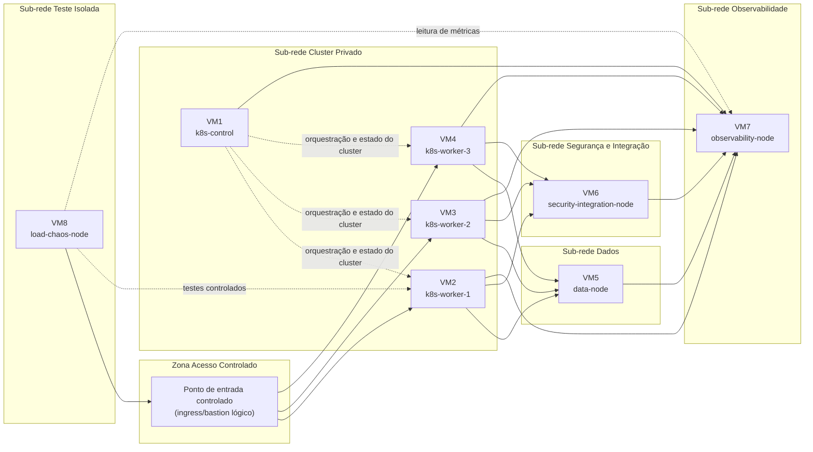
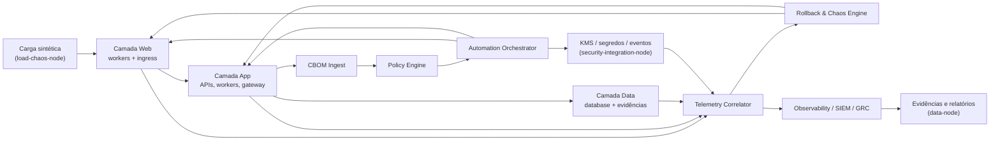
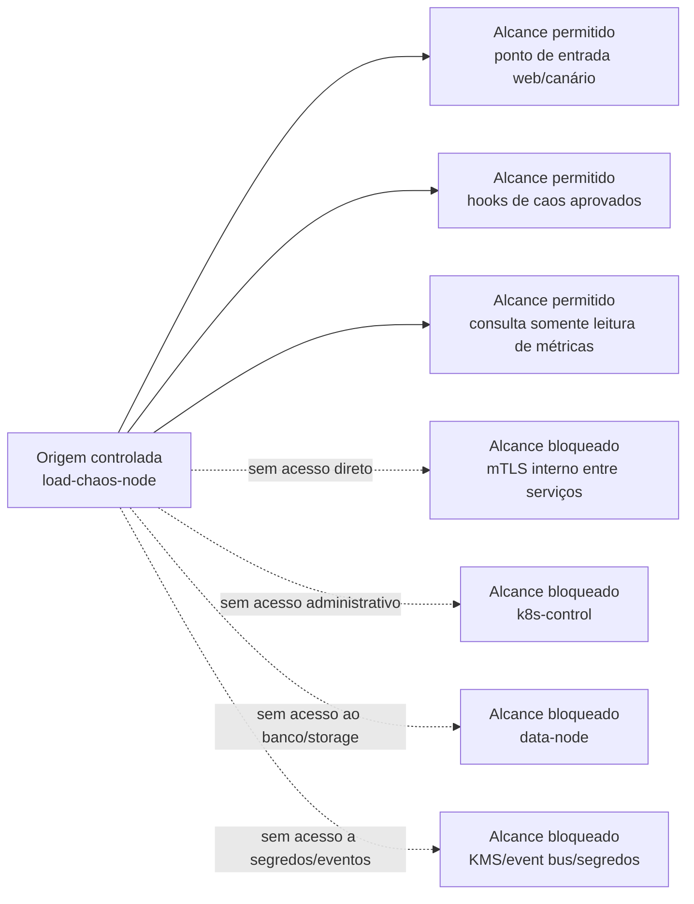

# Sprint 4 — Topologia de VMs e Rede

## 1. Objetivo
Documentar a separação física e lógica das `8 VMs` exigidas pelo ambiente da pesquisa, explicando como essa divisão sustenta desempenho mensurável, isolamento de segurança e alcance controlado dos ataques/falhas simuladas. O desenho segue `docs/governance/requisitos-ambiente.md`, reaproveita a arquitetura do gateway (`docs/module14/gateway-architecture.md`), a modelagem híbrida da Sprint 3 (`docs/module14/sprint3/hybrid-three-tier-model.md`) e antecipa os cenários operacionais consolidados na Sprint 5 (`docs/module14/sprint5-validacao-arquitetural-seguranca.md`).

## 2. Fontes de verdade utilizadas
- `docs/governance/requisitos-ambiente.md`
- `docs/module14/metrics-resilience-matrix.md`
- `docs/module14/pqc-cryptoagility-metrics-migration.md`
- `docs/module14/gateway-architecture.md`
- `docs/module14/sprint3/hybrid-three-tier-model.md`
- `docs/module14/sprint5-validacao-arquitetural-seguranca.md`
- `docs/module14/README.md`

## 3. Princípios adotados no desenho
- Separar geração de carga, observabilidade, integração/KMS e dados em VMs próprias para não misturar consumo de recursos com o sistema sob teste.
- Manter o plano de controle (`k8s-control`) fora do caminho direto de carga, reduzindo superfície de ataque e ruído em métricas.
- Preservar o fluxo principal `web -> app -> data`, mas com trilhas paralelas de controle, eventos e observabilidade, conforme o gateway da Sprint 2.
- Limitar o alcance do `load-chaos-node` a pontos de entrada explicitamente aprovados, evitando acesso direto a banco, KMS e controle do cluster.

## 4. Diagrama 1 — Topologia física das 8 VMs

Leitura do diagrama:
- Os três `k8s-workers` permanecem na mesma sub-rede privada do cluster, mas distribuídos para evitar colocalização completa de web, aplicação, gateway e canário em um único host.
- `data-node`, `security-integration-node` e `observability-node` ficam em sub-redes dedicadas para reduzir blast radius e isolar I/O de dados, segredos/eventos e telemetria.
- `load-chaos-node` fica fora do cluster principal, como exigido em `docs/governance/requisitos-ambiente.md`, para que a geração de carga não distorça CPU, memória e latência dos workers.

## 5. Diagrama 2 — Fluxos lógicos web -> app -> data + controle/observabilidade

Leitura do diagrama:
- O fluxo funcional principal continua simples: `web -> app -> data`.
- O gateway de criptoagilidade é um fluxo lateral de controle, não o caminho obrigatório de cada requisição de negócio.
- Telemetria, rollback e governança operam em paralelo ao dataplane, o que melhora análise causal de `HYB-*`, `OBS-*`, `RES-*` e `SWP-01`.

## 6. Diagrama 3 — Superfície de ataque simulada a partir do `load-chaos-node`

Interpretação de segurança:
- O `load-chaos-node` pode atingir apenas o ponto de entrada web, hooks aprovados de caos e consultas read-only de observabilidade necessárias ao experimento.
- O nó de carga não deve acessar diretamente `k8s-control`, `data-node`, service-to-service `mTLS` interno nem `security-integration-node`, o que reduz risco de interferência indevida e simulações irreais de ataque lateral.
- Esse alcance reduzido garante que cenários de carga e de caos observem o comportamento do sistema planejado, e não um artefato produzido por acesso privilegiado ao ambiente.

## 7. Legenda de fluxos, portas lógicas e protocolos

As portas numéricas definitivas não são fixadas pelo repositório nesta etapa. Para não inventar detalhes ainda não documentados, a Sprint 4 trabalha com classes de fluxo e protocolos de alto nível:

| Classe de fluxo | Protocolo/porta lógica | Origem -> destino | Uso na Sprint 4 |
| --- | --- | --- | --- |
| Norte-sul | `HTTPS/TLS 1.3` ou perfil híbrido equivalente | `load-chaos-node -> ingress/workers` | carga típica, canário web e comparação clássico vs híbrido |
| Leste-oeste | `mTLS` via service mesh | `k8s-worker <-> k8s-worker` | cenários de mTLS híbrido e detecção de política |
| Dados | `TLS/mTLS` para banco, storage e evidências | `workers -> data-node` | persistência do experimento e proteção de artefatos |
| Controle do cluster | API de orquestração do cluster | `k8s-control -> workers` | agendamento, canário e rollback; fora do alcance do `load-chaos-node` |
| Integração/segredos | APIs autenticadas de `KMS/Vault`, automação e event bus | `workers <-> security-integration-node` | rotação, políticas e troca criptográfica |
| Observabilidade | `OpenTelemetry`, scrape de métricas, logs/traces | `todos os nós -> observability-node` | `OBS-01`, `OBS-02`, evidências e correlação |
| Administração extraordinária | acesso administrativo restrito | bastion/admin -> VMs específicas | fora do caminho experimental; não utilizado como vetor de teste |

## 8. Como o desenho evita contaminação de métricas
- `load-chaos-node` em VM própria remove o custo da geração de carga do cluster sob teste, preservando leitura de `LAT-01`, `THR-01`, `HYB-02` e `PQC-OVH-02`.
- `observability-node` dedicado evita que ingestão de logs, métricas e traces concorra diretamente com web/app/data pelos mesmos recursos.
- `security-integration-node` concentra KMS, eventos e automação fora dos workers, reduzindo ruído de CPU/I/O em cenários de rotação, rollback e falha planejada.
- `data-node` isolado preserva medições de persistência e evita que stress de aplicação seja confundido com gargalos artificiais de storage local dos workers.
- `k8s-control` fora do caminho de carga evita que o plano de controle seja afetado por picos legítimos de experimento, o que protege comparabilidade entre rodadas.

## 9. Como o desenho melhora o isolamento de segurança
- A separação em sub-redes conceituais delimita o blast radius entre plano de dados, plano de controle, integração/KMS e observabilidade.
- O mapa de superfície de ataque parte explicitamente do `load-chaos-node`, reforçando que os cenários de caos devem respeitar o alcance aprovado pelo experimento.
- O bloqueio de acesso direto ao `data-node`, `k8s-control` e `security-integration-node` reduz risco de falsos positivos em cenários extremos e se alinha às preocupações de controle privilegiado documentadas na Sprint 5.
- A arquitetura preserva a premissa de dualidade entre desempenho e segurança: fluxos de canário, rollback e observabilidade são possíveis sem abrir acesso lateral indevido.

## 10. Limites desta sprint
- O desenho é lógico/físico de referência e não substitui matriz final de firewall, ACLs, manifests ou endereçamento.
- O repositório ainda não comprova implantação real das integrações mostradas; o objetivo aqui é explicitar separação, conexões e alcance permitido dos testes.
- Caso o provisionamento futuro reduza o número de instâncias, esta topologia deixa de ser a referência principal e a configuração mínima de `6 instâncias` passa a exigir nova revisão de isolamento e métricas.

## 11. Riscos abertos
- O desenho pressupõe que o provisionamento futuro preserve a separação entre geração de carga, observabilidade, integração/KMS e dados; qualquer consolidação de VMs altera diretamente o valor experimental das métricas.
- A ausência de portas numéricas e ACLs definitivas nesta sprint protege a consistência documental, mas exige uma revisão técnica específica quando a rede real for entregue.
- Se o `load-chaos-node` receber permissões além das previstas no Diagrama 3, a campanha pode medir um alcance de ataque artificialmente amplo e perder validade metodológica.
- A topologia assume que a coleta do `observability-node` será dimensionada sem impactar a malha de aplicação; isso ainda dependerá da calibração real de retenção, scraping e traces.
